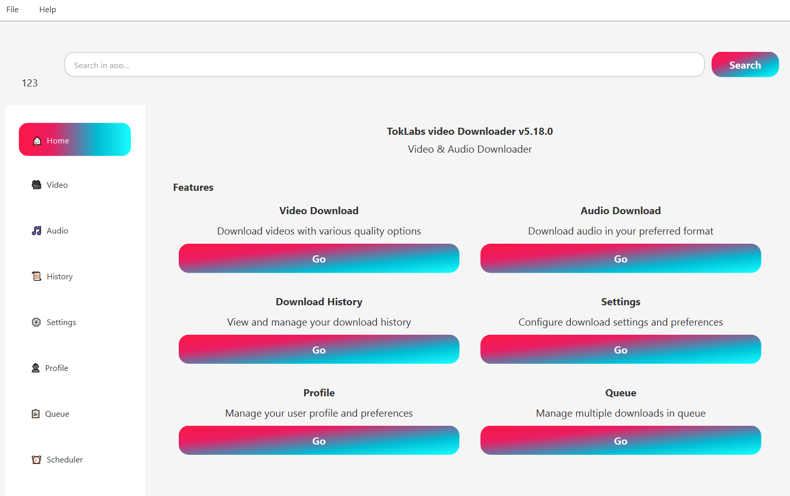

# 💚 TokUp - TikTok Video Downloader No Watermark Online 🎥 (High Quality & Fast)

**The ultimate TikTok downloader online — download TikTok videos without watermark in HD quality from any device.**

---

## ⚠️ Important Notice & Disclaimer

This software is intended for educational and personal use only. By using TokUp, you agree to:

- **Personal Archiving:** Download and save only your own content or publicly available content.
- **Respect Copyright:** You are responsible for ensuring you have the right to download and use the content.
- **No Affiliation:** Not affiliated with TikTok, ByteDance, or subsidiaries.
- **User Responsibility:** The developers assume no liability for misuse.

---

## 🌟 TokUp Features

- **No Watermark Downloads:** Save clean TikTok videos without watermark or logos
- **Lightning Fast Processing:** Quick analysis and download speeds (2-5 seconds)
- **HD Quality:** Download videos in the highest available quality
- **Mobile Responsive:** Works perfectly on all devices and screen sizes
- **No Registration Required:** Completely anonymous and secure
- **100% Free:** No hidden fees or premium subscriptions
- **Web-based:** No software installation needed
- **Safe & Secure:** All processing happens securely without storing your data

---

## 💻 Supported Formats & Quality

### Video Formats
- **MP4:** High-definition video format
- **Quality Options:** 1080p, 720p, 480p (depending on source)
- **No Watermark:** Clean videos without TikTok watermarks

### Supported URL Formats
```
https://www.tiktok.com/@username/video/1234567890
https://vm.tiktok.com/ZMxxxxxxx/
https://m.tiktok.com/v/1234567890.html
```

---

## 🔧 How to Use TokUp

### Download a Single TikTok Video (No Watermark)
1. **Get TikTok URL:** Open TikTok app/website, find the video, copy the link (share → copy link)
2. **Paste URL:** Visit TokUp and paste the URL in the input field
3. **Analyze:** Click "Get Video" and wait for processing (2-5 seconds)
4. **Download:** Click "Download HD Video" to save without watermark

### Supported Platforms
- 💻 **Desktop:** Windows, macOS, Linux (all browsers)
- 📱 **Mobile:** iOS, Android (Safari, Chrome, Firefox)
- 📟 **Tablet:** iPad, Android tablets
- 🖥️ **Smart TV:** Basic support

---

## 🛠️ Technical Stack

- **Frontend:** React 18 + TypeScript
- **Styling:** Tailwind CSS + Custom Design System
- **UI Components:** Radix UI + shadcn/ui
- **Build Tool:** Vite
- **State Management:** React Hooks
- **Icons:** Lucide React

---

## 📸 Screenshots

<p align="center">
  
</p>

---

## ❓ Frequently Asked Questions (FAQ)

### How do I download TikTok videos without watermark?
Paste the TikTok video URL into TokUp and click **Get Video**. Videos are processed and available for download in HD quality without watermark.

### Is TokUp free to use?
Yes, TokUp is completely free with no hidden fees or premium subscriptions.

### Do I need to register or create an account?
No registration required. TokUp works anonymously without storing your data.

### What video quality can I download?
TokUp downloads videos in the highest available quality, typically 1080p or 720p depending on the source video.

### Is it safe to use?
Yes, TokUp is safe and secure. We don't store your URLs or downloaded videos.

---

## 🚀 Quick Start

### Quick Install (Windows/macOS/Linux)

1. Download the latest release from the [Releases page](../../releases).
2. Run `TokUpDownloader.exe` (Windows) or launch via Python (macOS/Linux).
3. FFmpeg is bundled in installers. If using source, install manually.

### Local Development
```bash
# Clone the repository
git clone https://github.com/aioDevBotz/downloader-tiktok-video-no-watermark.git

# Navigate to project directory
cd downloader-tiktok-video-no-watermark

# Install dependencies
npm install

# Start development server
npm run dev
```

---

## 📊 Performance & Statistics

- ⚡ **Average Processing Time:** 2-5 seconds
- 📈 **Success Rate:** 95%+
- 🌍 **Global CDN:** Fast downloads worldwide
- 📱 **Mobile Optimized:** Responsive design
- 🔒 **Privacy First:** No data collection

---

## 🙏 Contributing

We welcome contributions!

### How to Contribute
1. Fork the project
2. Create your feature branch (`git checkout -b feature/AmazingFeature`)
3. Commit your changes (`git commit -m 'Add some AmazingFeature'`)
4. Push to the branch (`git push origin feature/AmazingFeature`)
5. Open a Pull Request

### Development Guidelines
- Follow the existing code style
- Add comments for complex logic
- Update documentation when needed
- Test on multiple devices/browsers
- Ensure accessibility compliance

---

## 📋 Roadmap

- [ ] 🎵 Audio-only download option (MP3)
- [ ] 📦 Batch download support
- [ ] 🔄 Auto-quality detection
- [ ] 📊 Download history
- [ ] 🌍 Multi-language support
- [ ] 🎯 Browser extension
- [ ] 📱 Mobile app (React Native)

---

## 🔗 Related Projects

- [yt-dlp](https://github.com/yt-dlp/yt-dlp) – Powerful video downloader
- [React](https://reactjs.org/) – UI framework
- [Tailwind CSS](https://tailwindcss.com/) – Styling framework
- [Radix UI](https://www.radix-ui.com/) – Headless components

---

## 🔒 Privacy Policy

- 🚫 We don't store your URLs or downloaded videos
- 🔐 All processing happens securely
- 📊 No personal data collection
- 🍪 Minimal cookies for functionality only

---

## 📄 License

This project is licensed under the MIT License - see the [LICENSE](LICENSE) file for details.

---

## 💬 Support

If you encounter any issues or have questions:

- 📧 Email: support@tokup.com
- 🐛 GitHub Issues: [Create an issue](https://github.com/aioDevBotz/downloader-tiktok-video-no-watermark/issues)


---

<div align="center">
  <h2>🚀 Enjoy using TokUp!</h2>
  <p><strong>⭐ Star this repository if TokUp helped you download TikTok videos!</strong></p>
  
  **Made with ❤️ for the TikTok community**

  [⭐ Star this repo](https://github.com/aioDevBotz/downloader-tiktok-video-no-watermark) • [🍴 Fork it](https://github.com/aioDevBotz/downloader-tiktok-video-no-watermark/fork)
</div>
